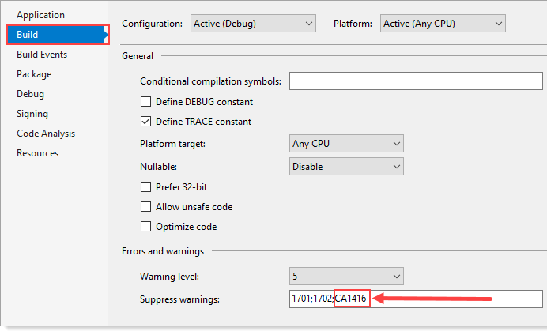

# About

Simple code samples for obtaining user informatio from active directory.

# Requires

**NuGet package** [System.DirectoryServices.AccountManagement](https://www.nuget.org/packages/System.DirectoryServices.AccountManagement/6.0.0-rc.1.21451.13) which is included in this project dependencies.

# Notes

Code presented is Windows platform dependent. Under project properties suppression has been used rather than having Visual Studio present a warning on platform dependent.

See also [preprocessfor directives](https://docs.microsoft.com/en-us/dotnet/csharp/language-reference/preprocessor-directives)

Under project properties

