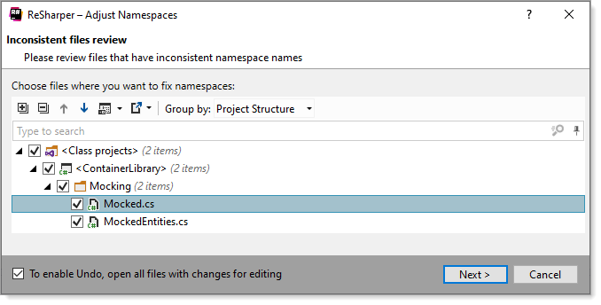

# About

Mocked data.

Inspect each class in this folder, note their namespace is the root namespace, not `ContainerLibrary.Mocking`. 

Without Reshaper changing the namespace will be errors on build which need addressing, with Resharper we have

