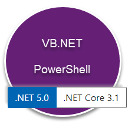

# Git Codes

Green check :heavy_check_mark:

<kbd>control</kbd> + <kbd>shift</kbd> + <kbd>W</kbd><br><br><br>


:purple_circle: Entity Framework Core

:yellow_circle: SQL client data provider

:red_circle:  :radio_button: :white_circle: :green_circle:

:red_square: :white_large_square: 	:green_square: 	:yellow_square:

:gear:   :mag:   :mag:


---

Stop sign :stop_sign:

:warning:

:radioactive:

This is **bold**

This is *italics*


| :white_check_mark: Do this   | :x: Don't do this |
| :--- | :--- |
| something | something else |


# Heading level 1

## Heading level 2

### Heading level 3

#### Heading level 4

##### Heading level 5

###### Heading level 6


Example images




> Block quote

Numbered List

1. First
2. Second
3. Third

Unordered list

- Item 1
- Item 2
- item 3

Paragraph in list

* This is the first list item.
* Here's the second list item.

    I need to add another paragraph below the second list item.

* And here's the third list item.

Json code block

```json
{
 "Identifier": 1,
 "TrSsn": "735485317",
 "TrAllDone": "Y",
 "TrBye": "3021",
 "TrChangePinInd": "N",
 "TrClaimFo": "081",
 "TrCompleteTime": "2020-08-04T11:15:13",
 "TrHrsWorked": null,
 "TrIcAcRoInd": "Z",
 "TrIpAddress": "73.25.21.24",
 "TrIvrCode": null,
 "TrLanguageCode": "E",
 "TrLastActivityTime": "2020-08-04T11:15:13",
}
```

C# code block

```csharp
public DateTimeOffset ReturnTimeOnServer(string clientString)
{
    string format = @"M/d/yyyy H:m:s zzz";
    var serverOffset = TimeZoneInfo.Local.GetUtcOffset(System.DateTimeOffset.Now);

    try
    {
        DateTimeOffset clientTime = System.DateTimeOffset.ParseExact(clientString, format, CultureInfo.InvariantCulture);
        DateTimeOffset serverTime = clientTime.ToOffset(serverOffset);
        return serverTime;
    }
    catch (FormatException)
    {
        return System.DateTimeOffset.MinValue;
    }
}
```

ASP.NET

```html
@page
@inject Microsoft.AspNetCore.Hosting.IWebHostEnvironment hostingEnv
@model AboutModel
@{
    ViewData["Title"] = "About";
}
<link href="~/lib/bootstrap/dist/css/bootstrap.css" rel="stylesheet" />

<h2>@ViewData["Title"]</h2>
<h3>@Model.Message</h3>

<div class="container">
    <p> ASPNETCORE_ENVIRONMENT  @hostingEnv.EnvironmentName</p>

    <environment include="Development">
        <div>The <strong>effective</strong> tag is: environment include="Development"</div>
    </environment>
    <environment exclude="Development">
        <div>The effective tag is: environment exclude="Development"</div>
    </environment>
    <environment include="Staging,Development,Staging_2">
        <div>
            The effective tag is:
            environment include="Staging,Development,Staging_2"
        </div>
    </environment>
    
</div>
```

css

```css
a.navbar-brand {
  white-space: normal;
  text-align: center;
  word-break: break-all;
}

/* Provide sufficient contrast against white background */
a {
  color: #0366d6;
}

.btn-primary {
  color: #fff;
  background-color: #1b6ec2;
  border-color: #1861ac;
}

.nav-pills .nav-link.active, .nav-pills .show > .nav-link {
  color: #fff;
  background-color: #1b6ec2;
  border-color: #1861ac;
}
```
