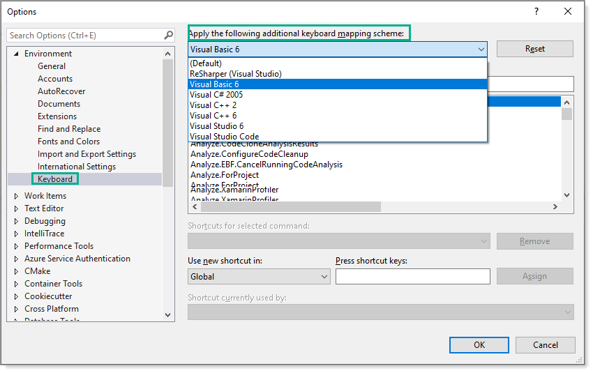
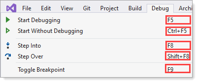

# Keyboard shortcuts

Common shortcuts may or may not be the same for all keyboard mapping schemas. In the table below are several common shortcuts.

To learn about shortuts investiage in Visual Studio menues e.g.

When not using the default mapping keyboard schema keyboard shortcuts be another shorcut may contradict one another. 

For instance to toggle code outlines may be <kbd>CTRL</kbd> + <kbd>O</kbd>, <kbd>M</kbd> but really be <kbd>CTRL</kbd> + <kbd>M</kbd>, <kbd>M</kbd>.

This is not a Visual Studio issue per-say as in the majority of cases it's done by a user even when Visual Studio warns againsts this.

| Command  | Keyboard shortcuts |
| :--- | :--- |
| Comment code block | <kbd>CTRL</kbd> + <kbd>K</kbd>, <kbd>C</kbd> |
| Uncomment code block | <kbd>CTRL</kbd> + <kbd>K</kbd>, <kbd>U</kbd> |
| Format code | <kbd>CTRL</kbd> + <kbd>K</kbd>, <kbd>D</kbd> |
| Surround code | <kbd>CTRL</kbd> + <kbd>K</kbd>, <kbd>S</kbd> |
| Editor to solution | <kbd>Ctrl</kbd> + <kbd>R</kbd> |
| Solution to editor | <kbd>Ctrl</kbd> + <kbd>F12</kbd> |
| Duplicate line | <kbd>CTRL</kbd> + <kbd>D</kbd> |
| Debug selected project | <kbd>F5</kbd> |
| Rebuld solution | <kbd>CTRL</kbd> + <kbd>SHIFT</kbd> + <kbd>B</kbd> |
| Clipboard list | <kbd>CTRL</kbd> + <kbd>SHIFT</kbd> + <kbd>V</kbd> |

---

| Select columns of text  |
| :--- |
| To select columns of text <kbd>CTRL</kbd> + <kbd>ALT</kbd> then using arrow keys <kbd>left</kbd> or  <kbd>right</kbd> <kbd>></kbd> <kbd>up</kbd> or <kbd>down</kbd> to select text. See the following video (which shows only [online](https://github.com/karenpayneoregon/oed-week1/blob/Week2/KeyboardShortcuts.md)).| 

