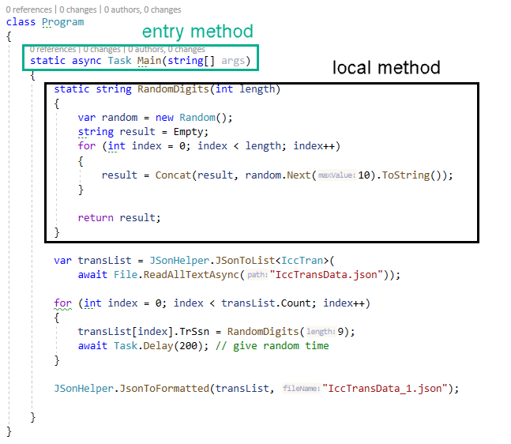

# About

ICC TRANS data came from the dev server. To protect `SSN` they have been sanitizated.

- Used System.Text.Json rather than NewtonSoft Json.Net

```csharp
using System;
using System.IO;
using System.Threading.Tasks;
using Json.Library;
using static System.String;

namespace GenerateSSN_1
{
    class Program
    {
        static async Task Main(string[] args)
        {
            static string RandomDigits(int length)
            {
                var random = new Random();
                string result = Empty;
                for (int index = 0; index < length; index++)
                {
                    result = Concat(result, random.Next(10).ToString());
                }

                return result;
            }
            
            var transList = JSonHelper.JSonToList<IccTran>(await File.ReadAllTextAsync("IccTransData.json"));

            for (int index = 0; index < transList.Count; index++)
            {
                transList[index].TrSsn = RandomDigits(9);
                await Task.Delay(200); // give random time
            }

            JSonHelper.JsonToFormatted(transList, "IccTransData_1.json");

        }
    }
}

```

**Developer note**

C# supports local methods, they tend to be used to work out code or to clear up a large body of code in a method.


