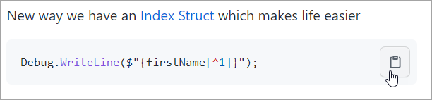
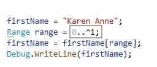

# Copy code in repository

When there is a `code snipplet` as shown below note the `copy to clipboard` button.



# Single character variables

:red_circle: Use sparingly, e.g. in a small, tight `for` or `while` statement, otherwise give variables meaningful names.

**Acceptable**

```csharp
string firstName = "Karen";

foreach (var c in firstName)
{
    Debug.WriteLine(c);
}
```

**Not acceptable** to use one character variables in code such as this which is why there are `no one character` variables.

```csharp
public static List<StudentEntity> GradesForPeople(int courseIdentifier)
{

    using var context = new SchoolContext();

    List<StudentEntity> studentEntities = context
        .StudentGrade
        .Include(studentEntity => studentEntity.Student)
        .Select(StudentGrade.Projection)
        .Where(studentEntity => studentEntity.CourseID == courseIdentifier)
        .ToList();

    foreach (var entity in studentEntities)
    {
        var letterGrade = entity.Grade.Value switch
        {
            >= 1.00m and <= 2.00m => "F",
            2.50m => "C",
            3.00m => "B",
            3.50m => "A",
            4.00m => "A+",
            _ => "unknown",
        };

        OnIteratePersonGradesEvent?.Invoke(new PersonGrades()
        {
            PersonID = entity.PersonID,
            FirstName = entity.FirstName,
            LastName = entity.LastName,
            Grade = entity.Grade,
            GradeLetter = letterGrade
        });

    }

    return studentEntities;

}
```        

# Interating characters in a string


var firstName = "Karen"

| K  | a | r | e | n|
| :--- | :--- | :--- | :--- | :--- |
| 0 | 1 | 2 | 3 | 4 |

---

## Looking at this in code

### Traditional using an [anonymous type](https://docs.microsoft.com/en-us/dotnet/csharp/fundamentals/types/anonymous-types)


| Note  |
| :--- |
| :small_blue_diamond: **@** prepended to char is an escape for C# key-word. |  
| |
        

```csharp

string firstName = "Karen";
var lettersIndexed = firstName
    .Select((@char, index) => new
    {
        Char = @char, 
        Index = index
    });

foreach (var indexedItem in lettersIndexed)
{
    Debug.WriteLine($"{indexedItem.Index} {indexedItem.Char}");
}
```

### Using a generic extension method `ForEach` with an anonymous type


```csharp
string firstName = "Karen";
var lettersIndexed = firstName
    .Select((@char, index) => new
    {
        Char = @char, 
        Index = index
    });


lettersIndexed.ToList().ForEach(indexedItem => Debug.WriteLine($"{indexedItem.Index} {indexedItem.Char}"));
```
</br>

### Strongly typed version of the above

In the following code sample

- `static class Extensions` belows in a separate class file
- `class CharIndexed` belows in a separate class file

| They are in the same file why? |
| :--- |
| When developing code we can place everything in the same file, get it to work. Once working, place (in this case) Extensions class and CharIndexed into a class project. Next, in a unit test project test the heck out of the extension method. |

```csharp
using System;
using System.Collections.Generic;
using System.Diagnostics;
using System.Linq;
using PlayGroundConsoleNetCoreApp.Classes;
using PlayGroundNetClassLibrary.Classes;

namespace PlayGroundConsoleNetCoreApp
{

    partial class Program
    {
        
        static void Main(string[] args)
        {
            string firstName = "Karen";
            var lettersIndexed = firstName
                .Select((@char, index) => new CharIndexed {Char = @char, Index = index});


            lettersIndexed.ToList().ForEach(indexedItem 
                => Debug.WriteLine($"{indexedItem.Index} {indexedItem.Char}"));
            
            Debug.WriteLine("");
            
            firstName.Indexed().ForEach(indexedItem 
                => Debug.WriteLine($"{indexedItem} "));
        }
    }

    public static class Extensions
    {
        public static List<CharIndexed> Indexed(this string sender) 
            => sender.Select((@char, index) => 
                new CharIndexed { Char = @char, Index = index }).ToList();

    }
    public class CharIndexed
    {
        public char Char { get; set; }
        public int Index { get; set; }

        public override string ToString()
        {
            return $"{{ Char = {Char}, Index = {Index} }}";
        }
    }
}

```


# Get characters from start of string

**Get first character**

- Debug.WriteLine($"{firstName[0]}");


**Get second character**

```csharp
Debug.WriteLine($"{firstName[1]}");
```

## Get last character

Old way to index to last character being zero based we need .Length -1

```csharp
Debug.WriteLine($"\{firstName[firstName.Length -1]}");
```

New way we have an [Index Struct](https://docs.microsoft.com/en-us/dotnet/api/system.index?view=net-5.0) which makes life easier

```csharp
Debug.WriteLine($"{firstName[^1]}");
```

**Note**

The old way is good for regular indexing while using a `Index` can be of benefit for travering in reverse.

# Get last seven characters

```csharp
// hard wired to get last 7 characters
string firstName = "Karen Anne";
firstName = firstName[^7..]; //Equivalent of input[^7..^0]
Debug.WriteLine(firstName); 


// variable method to get last 7 characters
firstName = "Karen Anne";
int indexer = 7;
if (firstName.Length <= 10)
{
    Range range = ^indexer..^0;
    Debug.WriteLine(firstName[range]);
}
```

# Get all characters excluding the last character

```csharp
firstName = "Karen Anne";
firstName = firstName[..^1]; //Equivalent of input[0..^1], all chars except last character
Debug.WriteLine(firstName); 
```
The following will produce the same results as the last code block while being informed `0..` is not needed.




# Removing characters from end to start

Since this could be something which may be needed more than once let's use a [language extension](https://docs.microsoft.com/en-us/dotnet/csharp/programming-guide/classes-and-structs/extension-methods).

:small_blue_diamond: An extension must reside in a static class.


:small_blue_diamond: **=>** is known as a arrow operator or lambda operator

```csharp
public static class StringExtensions
{
    public static string TrimLastCharacter(this string sender) 
        => string.IsNullOrWhiteSpace(sender) ? sender : sender.TrimEnd(sender[^1]);

}
```

The logic to remove characters is to remove a char from the end of a string in a `while` statement until the string is empty using [String.IsNullOrWhiteSpace](https://docs.microsoft.com/en-us/dotnet/api/system.string.isnullorwhitespace?view=net-5.0).

```csharp
while (!string.IsNullOrWhiteSpace(firstName))
{
    firstName = firstName.TrimLastCharacter();
    Debug.WriteLine(firstName);
}
```

To remove characters from start to end we use a generic extension method [Reverse](https://docs.microsoft.com/en-us/dotnet/api/system.linq.enumerable.reverse?view=net-5.0).

```csharp
IEnumerable<char> charSequence = firstName.Reverse();
firstName = new string(charSequence.ToArray());

while (!string.IsNullOrWhiteSpace(firstName))
{
    firstName = firstName.TrimLastCharacter();
    Debug.WriteLine(firstName);
}
```

- Some may come up with alternate methods from what has been shown, if it's better always share with your teammates.
- When you believe it's better make sure to fully test code with small and large strings alike Karen is an advocate of unit testing.


# Remove all white space from start of a string

Not as simple as it may sound

```csharp
firstName = "K a r e n";

firstName = firstName
    .ToCharArray()
    .Where(character => !char.IsWhiteSpace(character)).Select(c => c.ToString())
    .Aggregate((value1, value2) => value1 + value2);
```    

| Enumerable.[Aggregate](https://docs.microsoft.com/en-us/dotnet/api/system.linq.enumerable.aggregate?view=net-5.0) Method |
| :--- |
| Applies an accumulator function over a sequence. The specified seed value is used as the initial accumulator value, and the specified function is used to select the result value.|
| |


Imagine having to use this code in multiple places in code, yuk. This is the perfect use for a language extension method.

```csharp
public static class StringExtensions
{   
    public static string RemoveAllWhiteSpace(this string sender) 
        => sender
            .ToCharArray().Where(character => !char.IsWhiteSpace(character))
            .Select(c => c.ToString()).Aggregate((value1, value2) => value1 + value2);
}
```

Now we can write

```csharp
firstName = "K a r e n";

Debug.WriteLine(firstName.RemoveAllWhiteSpace());
```

</br>

# What about array?

First off, the classes belong in their own files.

Karen will walk you through this code.

```csharp
using System;
using System.Collections.Generic;
using System.Diagnostics;
using System.Globalization;
using System.Linq;
using PlayGroundConsoleNetCoreApp.Classes;
using PlayGroundNetClassLibrary.Classes;

namespace PlayGroundConsoleNetCoreApp
{
    partial class Program
    {

        static void Main(string[] args)
        {
            var russianMonthNames = CultureHelpers.RussianMonthNames();

            // get last six months of the year
            var lastSixMonthsVietnamese = russianMonthNames.ToArray()[^7..];

            // month names
            foreach (var result in lastSixMonthsVietnamese)
            {
                Debug.WriteLine(result);
            }
            
            Debug.WriteLine("Month name and month index");

            /*
             * Proof of concept which is why the last .ToList and .ForEach
             *
             * Note x.Index,-5:D2 means pad right 5 chars, place leading zero's on index
             */
            lastSixMonthsVietnamese
                .ToList()
                .Select((name, index) => new { Name = name, Index = index +6 })
                .ToList()
                .ForEach(x => Debug.WriteLine($"{x.Index,-5:D2}{x.Name}"));
            
        }
    }
}

public class CultureHelpers
{
    /// <summary>
    /// Get all known cultures on the current machine
    /// </summary>
    public static List<CultureItem> GetAllCultureItems
        => CultureInfo
            .GetCultures(CultureTypes.AllCultures)
            .OrderBy(cultureInfo => cultureInfo.EnglishName)
            .Select(culture => new CultureItem {EnglishName = culture.EnglishName, Name = culture.Name})
            .ToList();
    /// <summary>
    /// Returns a string list of month names for the current culture
    /// </summary>
    /// <returns>
    /// List of month names for current culture
    /// </returns>
    public static List<string> MonthNames() =>
        Enumerable.Range(1, 12)
            .Select((index) => DateTimeFormatInfo.CurrentInfo.GetMonthName(index))
            .ToList();


    public static List<string> RussianMonthNames() =>
        Enumerable.Range(1, 12)
            .Select((index) => new CultureInfo("ru-RU").DateTimeFormat.GetMonthName(index))
            .ToList();

    public static List<string> VietnameseMonthNames() =>
        Enumerable.Range(1, 12)
            .Select((index) => new CultureInfo("vi").DateTimeFormat.GetMonthName(index))
            .ToList();
}
    public class CultureItem
    {
        public string EnglishName { get; set; }
        public string Name { get; set; }
        public override string ToString() => $"{Name,-20}{EnglishName}";

    }
```


|   |
| :--- |
| Get use to working with [GitHub commits](https://docs.microsoft.com/en-us/learn/modules/visual-studio-github-push/) and [stashing](https://www.thomasclaudiushuber.com/2019/04/10/the-git-stash-functionality-in-visual-studio-2019/) for starters |
| |


</br>

# Resources

- [C# 8 Ranges and Indices in detail](https://github.com/karenpayneoregon/indexes-ranges-csharp)
- [Range examples](https://github.com/karenpayneoregon/csharp-features/tree/master/Ranges-examples)
- [Index Struct](https://docs.microsoft.com/en-us/dotnet/api/system.index?view=net-5.0&ns-enrollment-id=zkrzs51k3wq5x2&viewFallbackFrom=net-5.0%3Fns-enrollment-type%3DCollection)
- [Range Struct](https://docs.microsoft.com/en-us/dotnet/api/system.range?view=net-5.0)
- [char](https://docs.microsoft.com/en-us/dotnet/csharp/language-reference/builtin-types/char) (C# reference)
- [String Class](https://docs.microsoft.com/en-us/dotnet/api/system.string?view=net-5.0)
- [Structure types](https://docs.microsoft.com/en-us/dotnet/csharp/language-reference/builtin-types/struct) (C# reference)