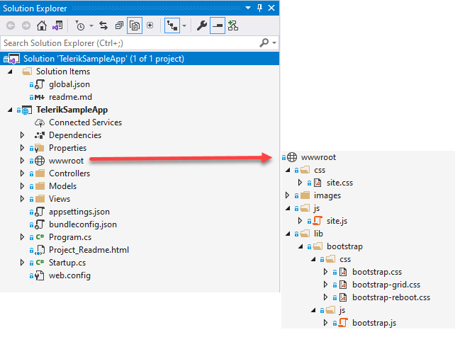
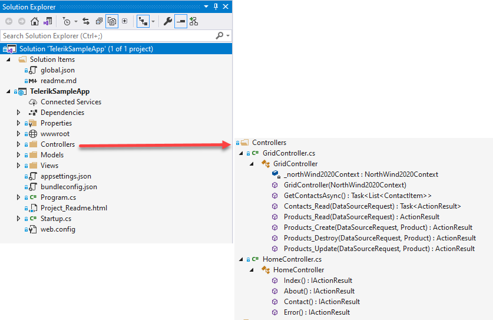
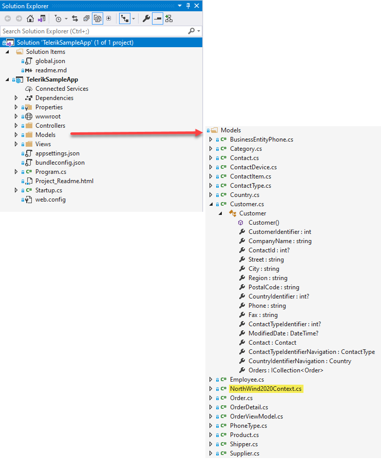
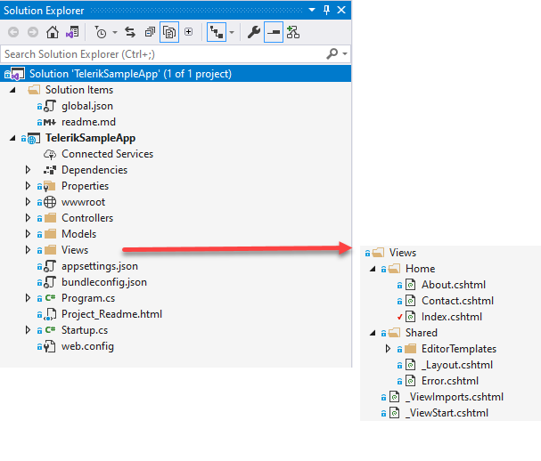
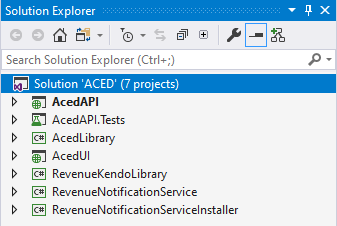
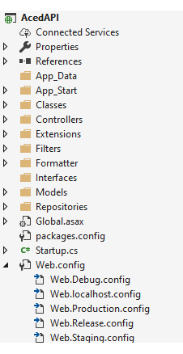
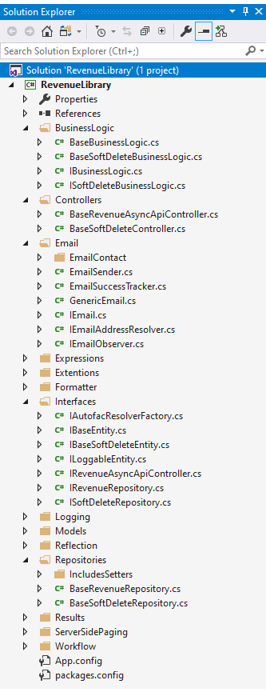

| Conventional ASP solution  |
| :--- |
| Using this structure is standard layout for ASP.NET Core applications by using Visual Studio templates. |
| Below (ASP.NET as Core was not out yet) is a more efficient structure which was done by creating several new projects and ripping out all standard code so that developers had full control over all aspects of code.  There is one index page which constitutes a SPA application using a library which supports JQuery templates and replacement parameters obtaining data primarily from Entity Framework using a SQL-Server database outfacing using OWIN and B2C authentication. |
| **Note** that there is also a team Visual Studio solution which the project depends on for base generic classes. |









# Advance ASP solution

High level view



The following class project is considered the API of the web application

**Sample controller**
```csharp
namespace AcedAPI.Controllers
{
    [Authorize]
    public class CourseCreditsController : BaseSingleItemRevenueAPIController<CourseCredit, CourseCreditDTO, CourseCreditRepository>
    {
        public ILogger Logger { get; set; }

        public CourseCreditsController(ILogger logger) : this()
        {
            Logger = logger;
        }

        public CourseCreditsController()
        {
            Repository = new CourseCreditRepository();
            CreateMap();
        }
    }
}
```
Sample worker class

```csharp
using AcedLibrary;
using System.Linq;

namespace AcedAPI.Calculations
{
    public class AttendanceCalculator
    {
        public AcedEntities DbContext { get; set; }

        public AttendanceCalculator(AcedEntities context)
        {
            DbContext = context;
        }

        public void AutoAddAttendanceRecords(Roster pRoster)
        {
            var sessionDatesMissingAnAttendanceRecord = 
                from sessionDate in DbContext.SessionDates
                where sessionDate.SessionId == pRoster.SessionId
                where sessionDate.RosterSessionDates.All(rsd => rsd.RosterId != pRoster.RosterId)
                select sessionDate;

            foreach (var sessionDate in sessionDatesMissingAnAttendanceRecord)
            {
                AddRosterSessionDate(pRoster, sessionDate.SessionDateId);
            }
        }

        public void AutoAddAttendanceRecords(SessionDate pSessionDate)
        {
            var rostersMissingAnAttendanceRecord = 
                from roster in DbContext.Rosters
                where roster.SessionId == pSessionDate.SessionId
                where roster.RosterSessionDates.All(rsd => rsd.SessionDateId != pSessionDate.SessionDateId)
                select roster;

            foreach (var roster in rostersMissingAnAttendanceRecord)
            {
                AddRosterSessionDate(roster, pSessionDate.SessionDateId);
            }
        }

        /// <summary>
        /// Adds a RosterSessionDate link record to the DB for the given Roster
        ///  and SessionDate
        /// </summary>
        /// <param name="roster"></param>
        /// <param name="sessionDateId"></param>
        protected void AddRosterSessionDate(Roster roster, int sessionDateId)
        {
            DbContext.RosterSessionDates.Add(new RosterSessionDate
            {
                Roster = roster,
                SessionDateId = sessionDateId,
                AmSession = false,
                PmSession = false
            });
        }
    }
}
```

Authenication worker

```csharp
using AcedApi.MicrosoftGraph;
using System.Threading.Tasks;

namespace AcedAPI.Classes.MicrosoftGraph
{
    public static class GraphClientExtensions
    {
        public static async Task<string> AddUserToGroup(this AzureGraphRestClient sender, string pRestStringQuery, string pJsonResourceCollection)
        {
            return await sender.Post(pRestStringQuery, pJsonResourceCollection);
        }

        public static async Task<string> RemoveUserToGroup(this AzureGraphRestClient sender, string pRestStringQuery, string pJsonResourceCollection)
        {
            return await sender.Delete(pRestStringQuery, pJsonResourceCollection);
        }
    }
}
```

Sample repository

```csharp
using AcedAPI.Models;
using AcedLibrary;
using AutoMapper;
using Revenue.Common.Interfaces;
using Revenue.Common.Repositories;
using System.Collections.Generic;
using System.Linq;

namespace AcedAPI.Repositories
{
    /// <summary>
    /// Karen Payne added ValidateUserIsContact
    /// </summary>
    /// <typeparam name="TEntity"></typeparam>
    /// <typeparam name="TContext"></typeparam>
    public abstract class BaseAcedRepository<TEntity, TContext> : BaseRevenueRepository<TEntity, TContext>
        where TEntity : class, IBaseEntity
        where TContext : AcedEntities
    {
        /// <summary>
        /// Returns a single contact based on login user's credentials.
        /// </summary>
        /// <param name="Id"></param>
        /// <returns></returns>
        public IEnumerable<Contact> GetSingleContact(int Id)
        {
            return new AcedContact(Context).GetSingleContact(Id);
        }

        /// <summary>
        /// Converts the collection of Rosters to a collection of RosterDTOs
        /// </summary>
        /// <param name="rosters"></param>
        /// <returns></returns>
        protected IEnumerable<RosterDTO> ConvertRostersToDTO(IEnumerable<Roster> rosters)
        {
            Mapper.CreateMap<Roster, RosterDTO>()
                .ForMember(dest => dest.RosterSessionDates,
                    opt => opt.MapFrom(src => src.RosterSessionDates
                                                .Where(rsd => !rsd.SessionDate.IsDeleted)
                                                .OrderBy(rsd => rsd.ClassDate)));
            Mapper.CreateMap<RosterSessionDate, RosterSessionDateDTO>();

            var rosterDTOs = Mapper.Map<IEnumerable<Roster>, IEnumerable<RosterDTO>>(rosters);

            return rosterDTOs;
        }

        /// <summary>
        /// Get contact by claims user id
        /// </summary>
        /// <param name="pUserId">identifier from user ClaimsIdentity</param>
        /// <returns>single contact</returns>
        public Contact GetContactByClaimsUserId(int pUserId)
        {
            return new AcedContact(Context).GetContactByClaimsUserId(pUserId);
        }

        public bool ValidateUserIsContact(int pUserId, int pContactId)
        {
            return Context.StudentUsers.Any(student => student.UserId == pUserId && student.ContactId == pContactId);
        }

        public bool ValidateUserOrgAuth(int pUserId, int pContactId)
        {
            return (Context.StudentUsers.Where(student => student.UserId == pUserId).FirstOrDefault()
                .Contact.OrganizationId == Context.Contacts.FirstOrDefault(contact => contact.ContactId == pContactId).OrganizationId);
        }
    }
}
```





**Team library**

