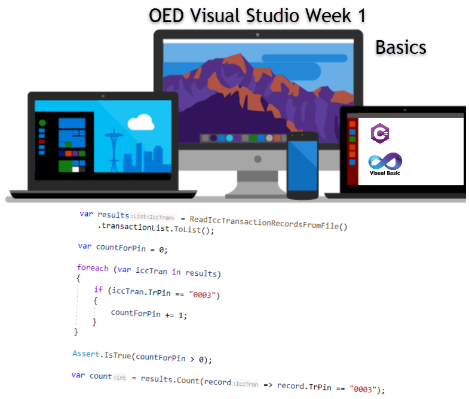

# Outline

Visual Studio is an IDE/editor with immense functionality and with that comes some getting used to in regards navigation. There are seasoned developers who have been using Visual Studio for years that never explore the full power of Visual Studio. This week and the weeks to follow you wil all become ninjas with navigating Visual Studio and unlock it's full potential.

- We will explore the basics of using Visual Studio which must be done prior to writing a single line of code. Each week along with learning to code new aspects of the IDE will be revealed. To reveal them all in one class would be too much, don't believe it, wait for class tomorrow.
- When it gets to a point everyone has itchy fingers to code we will pause and write some simple code then move back to learning Visual Studio

## Expectations

- This is your class unlike lock step commercial classes so 
  - Ask questions and clarification on anything which is not clear. 
  - Tell me if the pace is too fast, we can slow down the pace
- Knowing that just listening can be tiring let me know and I will have a super simple code session.