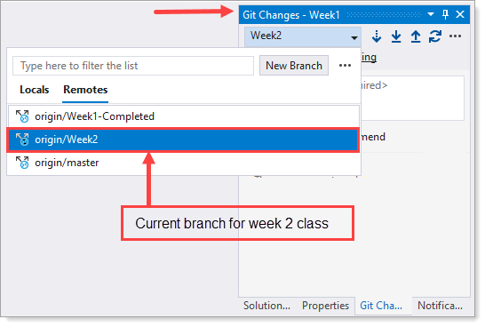

# About

**Week 2** Course 09/17/2021

[Keyboard information](https://github.com/karenpayneoregon/oed-week1/blob/Week2/KeyboardShortcuts.md)

# Visual Studio GitHub

For homework scan/read through the information below

[Microsoft docs](https://docs.microsoft.com/en-us/visualstudio/version-control/git-with-visual-studio?view=vs-2019)

[How Visual Studio makes source control easy](https://docs.microsoft.com/en-us/visualstudio/version-control/git-visual-studio-source-control?view=vs-2019)

## GitHub branch

### Fetch and pull

For the sake of context, it’s worth remembering that we’re probably working in a clone repo. What’s a clone? It's simply a duplicate of another repository. It is basically getting your own copy of someone else’s source code.

That’s where [fetch](https://git-scm.com/docs/git-fetch) and [pull](https://git-scm.com/docs/git-pull) come in.

- `git fetch` is the command that tells your local git to retrieve the latest meta-data info from the original (yet doesn’t do any file transferring. It’s more like just checking to see if there are any changes available).
- `git pull` on the other hand does that AND brings (copy) those changes from the remote repository.

There generally are at least three copies of a project on your workstation.

- One copy is your own repository with your own commit history (the already saved one, so to say).
- The second copy is your working copy where you are editing and building (not committed yet to your repo).
- The third copy is your local “cached” copy of a remote repository (probably the original from where you cloned yours).

